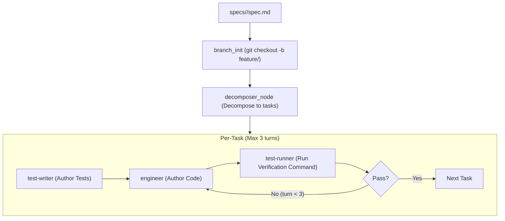

# Implementer Agent Skill

This skill provides the standard workflow to invoke the **Unified Implementer Agent** (`sdlc-agents/implementer`), progressing a feature specification through automated decomposition, test creation, code implementation, and verification with real-time status streaming.

---

## When to Use This Skill

Activate this skill when:
- The user asks to implement or develop a feature specification (e.g., `specs/<feature>/spec.md`).
- The user asks to "run the implementer agent", "execute spec", or "implement feature".
- Automated multi-agent SDLC orchestration is required for a new feature.

---

## Agent Architecture & Subagents

The implementer agent runs as an **Antigravity SDK Pipeline** with policy-enforced subagents:



---

## Real-Time Status Streaming

The implementer agent emits live progress status messages with compact badges throughout each stage of execution:
- **`[Branch]`**: 🌿 Feature branch checkout and workspace preparation.
- **`[Decomposer]`**:
  - Spec analysis start (`📋 Analyzing spec <spec.md> to generate task decomposition...`)
  - Sub-task creation in real-time (`📝 Created task 001: 001-<task-name> (<Task Title> - <Brief description>)`)
  - Decomposition completion summary (`📋 Generated N tasks: 001-<task>, 002-<task>, ...`)
- **`[Orchestrator]`**: 🚀 Total task count and pipeline initialization.
- **`[Task X/N: <task_name>]`**:
  - Subagent test preparation (`🧪 Test-Writer prepared tests: <summary>`)
  - Subagent implementation turns (`⚙️ Engineer completed (Turn T/3): <summary>`)
  - Subagent verification execution (`🔬 Test-Runner executing verification...`)
  - Verification result (`✅ Verification PASSED on Turn T/3 (<summary>)` or `❌ Verification FAILED on Turn T/3 (<diagnostics>)`)
  - Retry turn notice (`🔄 Engineer starting Turn T+1/3 to resolve failures...`)
  - Task completion (`🎉 Task completed successfully in T turns`) or blocker notification (`🛑 Blocked after 3 turns`)
- **`[Summary]`**: 🏁 Final Markdown summary table with status, branch, and turns per task.

---

## Assistant Guidance: Continuous Running Updates in Chat

**CRITICAL**: When invoking the implementer skill on behalf of the user, do **NOT** post a single initial message and then remain silent. You must maintain a running, chatty update stream in the conversation, reporting every major subagent phase as it happens:

1. **🌿 Branch Initialization**: Post when the feature branch is created/checked out.
2. **📋 Decomposition Phase**:
   - Post when decomposition starts (`[Decomposer] 📋 Analyzing spec...`).
   - Post each sub-task creation update as it streams (`[Decomposer] 📝 Created task 001: 001-<task-name> (...)`).
   - Post the breakdown of generated tasks (`001-...`, `002-...`) when decomposer finishes.
3. **🚀 Per-Task & Subagent Phase Milestones**: For every task, output running updates in chat for:
   - Task start (`[Task X/N: <name>] 🚀 Starting execution`)
   - Test-writer outcome (`[Task X/N] 🧪 Test-Writer prepared tests in <test_files>`)
   - Engineer implementation outcome (`[Task X/N] ⚙️ Engineer completed (Turn T/3): <summary>`)
   - Test-runner outcome (`[Task X/N] ✅ Verification PASSED` or `[Task X/N] ❌ Verification FAILED: <diagnostics>`)
   - Engineer retry notice (`[Task X/N] 🔄 Engineer starting Turn T+1/3 to address test failures`)
   - Task completion (`[Task X/N] 🎉 Task completed successfully in T turn(s)`)
4. **🛑 Blocker Alert**: If a task fails verification after 3 turns, immediately alert the user with the failure diagnostics.
5. **🏁 Final Summary**: Present the completed SDLC execution table, branch name, and next steps (e.g. PR creation).

---

## Invocation Instructions

### 1. Identify Target Specification
Ensure the target specification exists at:
`specs/<feature>/spec.md` or `specs/<feature>/`

### 2. Invoke via the Client Tool
Execute the client script using the `sdlc-agents` Python environment:

```bash
sdlc-agents/.venv/bin/python sdlc-agents/implementer/client.py specs/<feature>
```

#### What this command does automatically:
1. **Active Check**: Scans ports `8090` through `8099` (checking `.scratch/implementer_port.txt` first) to see if an implementer server is active.
2. **Auto-Launch**: If no active server is found, selects the first available port in `8090-8099`, launches `uvicorn server:app --port <port> --reload` in the background, and waits for health readiness.
3. **Task Dispatch & Live SSE Streaming**: Dispatches the feature spec path to `/a2a/implementer_agent` and streams live Server-Sent Events (SSE) telemetry directly to the console in real-time.

---

## Remote / Deployed Execution (Cloud Run & Agent Runtime)

When the implementer agent is deployed to Cloud Run or Vertex AI Agent Runtime, pass the target URL or set `IMPLEMENTER_AGENT_URL`:

```bash
sdlc-agents/.venv/bin/python sdlc-agents/implementer/client.py specs/<feature> --url https://<deployed-service-url>
```

---

## Direct CLI Mode (Alternative)

To run the workflow in-process directly via CLI without HTTP:

```bash
sdlc-agents/.venv/bin/python sdlc-agents/implementer/main.py specs/<feature>
```

---

## Verification & Status Reporting

After execution finishes:
1. Review generated task files in `specs/<feature>/tasks/`.
2. Review authored tests in `tests/` and implementation in `src/`.
3. Check execution summary and report the pass/fail status and turn count per task.
