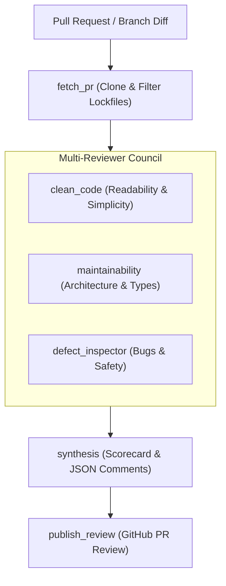

# Pull Request Reviewer Agent Skill

This skill provides the standard workflow to invoke the **Reviewer Agent** (`sdlc-agents/reviewer`), evaluating pull requests for clean code, structural maintainability, and runtime defect safety.

---

## When to Use This Skill

Activate this skill when:
- The user asks to review a Pull Request (e.g. `PR #1`).
- The user asks to perform an automated code quality or maintainability review on modified code.
- Continuous integration workflows evaluate incoming pull requests on GitHub.

---

## Agent Architecture & Subagents



---

## Invocation

### Via CLI Client:
```bash
sdlc-agents/.venv/bin/python sdlc-agents/reviewer/client.py --pr <PR_NUMBER> --repo-url <REPO_URL> --github-token <GITHUB_TOKEN>
```
