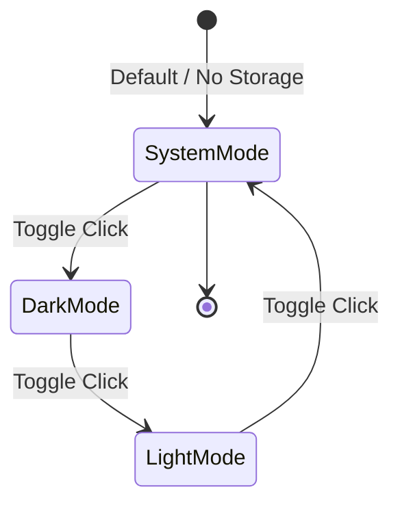

# FEAT-DARK-MODE: Client-Side 3-State Dark Mode Theme Toggle

**Issue Type:** User Story / Feature Spec  
**Status:** Certified  
**Priority:** Medium  

## 1. Description & Context
**As a** PurrfectName web application user,  
**I want to** toggle the visual theme between Light, Dark, and System modes using an accessible floating UI toggle,  
**So that** I can comfortably browse and generate cat names in low-light environments without eye strain while preserving my preferred display mode across visits.

## 2. Key Product Decisions & User Feedback
* **Decision 1 (3-State Theme Modes):** The application supports a 3-state theme cycle: `system` (default matching OS `prefers-color-scheme`), `dark` (forced dark theme), and `light` (forced light theme).
* **Decision 2 (UI Placement & Feedback):** The theme toggle control is positioned as an accessible, fixed floating button in the bottom corner of the viewport. When in `system` mode, the toggle's tooltip and accessible label dynamically reflect the active resolved state (e.g., "Theme: System (Dark)").
* **Decision 3 (Persistence & Namespacing):** User theme selection is persisted in client storage using a dedicated namespaced key (`purrfectname:theme`) with strict safelist validation (`'light' | 'dark' | 'system'`).
* **Decision 4 (Storage Resilience & Sandbox Fallback):** If client storage is inaccessible (incognito mode, restrictive iframe, or cookies disabled), the application falls back gracefully to in-memory state and OS preference without throwing unhandled exceptions.
* **Decision 5 (Accessibility & Screen Reader Throttling):** Theme transitions trigger polite ARIA live region announcements (debounced to prevent auditory stacking under rapid clicks) and dynamic `aria-label`/`aria-pressed` state updates.

## 3. Business Context & User Workflow
### User Personas
* **Night Owl / Late-Night Pet Adopter:** Browses cat names late at night in dim lighting; needs high-contrast dark visual presentation to minimize eye fatigue.
* **Accessibility-Conscious User:** Relies on operating system dark mode settings and screen readers to perceive and interact with web controls.
* **Daytime Browser:** Prefers clean, bright pastel aesthetics during daylight hours or in brightly lit rooms.

### Workflow & State Transitions
1. **Initial Load (System Default & FOUC Prevention):**
   - Synchronous theme resolution executes prior to full body render to prevent visual flashing.
   - If no valid stored preference exists, theme resolves dynamically from the user's OS preference (`prefers-color-scheme: dark`).
   - If the OS preference changes in real-time while in `system` mode, the UI updates synchronously and event listeners are cleanly managed throughout the lifecycle.
2. **User Interaction (Cycling States):**
   - User activates the floating toggle button (via click or keyboard `Enter`/`Space`).
   - Theme advances in the sequence: `System` ➔ `Dark` ➔ `Light` ➔ `System`.
   - The active theme applies instantly across all application surfaces via standard class-list modifications on `document.documentElement` without injecting raw inline CSS.
   - Selection is validated against the safelist and saved to namespaced client storage (`purrfectname:theme`).
   - Screen reader users receive a polite live announcement of the new active mode.

## 4. Behavior-Driven Development (BDD) Acceptance Criteria

### AC1: Default Initialization & System Mode Detection
* **Given** a user opens the PurrfectName application for the first time with no prior stored theme preference,
* **When** the page loads,
* **Then** the application mode defaults to `system`,
* **And** the rendered visual styling matches the active OS color scheme (dark styling if OS prefers dark, light styling if OS prefers light),
* **And** the floating toggle reflects the `system` state with an explicit dynamic tooltip and accessible description (e.g., `System (Dark)` or `System (Light)`).

### AC2: Real-Time OS Preference Change in System Mode
* **Given** the user is currently in `system` theme mode,
* **When** the operating system toggles its color scheme between light and dark,
* **Then** the application visual presentation updates immediately to match the new OS color scheme without requiring a page refresh,
* **And** the event listener is automatically torn down upon component unmounting to prevent memory leaks.

### AC3: Manual 3-State Theme Cycling
* **Given** the application is loaded in `system` mode,
* **When** the user activates the floating theme toggle control,
* **Then** the theme state transitions to `dark`,
* **And** dark styling is applied across all UI components (background, cards, drawer, badges, inputs),
* **When** the user activates the toggle again,
* **Then** the theme state transitions to `light`,
* **When** the user activates the toggle a third time,
* **Then** the theme state returns to `system`.

### AC4: Persistence Across Sessions & FOUC Prevention
* **Given** the user has manually selected `dark` mode,
* **When** the user reloads the page or reopens the application in a new tab within the same browser origin,
* **Then** `dark` mode is immediately restored prior to visual paint without a white flash or visual flickering.

### AC5: Storage Failure & Incognito Graceful Fallback
* **Given** client storage access is disabled, restricted, or throws a security exception (e.g., third-party cookies blocked, private browsing sandbox),
* **When** the user toggles theme preferences or loads the application,
* **Then** the application does not crash or throw uncaught exceptions,
* **And** persists the theme state in-memory for the duration of the current session.

### AC6: Corrupted Storage Value Sanitization (Threat Hygiene)
* **Given** client storage contains an invalid or tampered value under `purrfectname:theme` (e.g., arbitrary string or script payload),
* **When** the application initializes,
* **Then** the invalid value is rejected by a strict safelist validator (`['light', 'dark', 'system']`),
* **And** the application safely falls back to `system` mode without executing or rendering untrusted content.

### AC7: Accessibility & Assistive Technology Support
* **Given** a user navigating via keyboard or screen reader,
* **When** the user focuses on the floating theme toggle button,
* **Then** the button provides a visible focus ring,
* **And** announces an explicit accessible label describing the action and current state (e.g., `Current theme: System (Dark). Press to switch to Dark mode.`),
* **And** triggering the button emits an ARIA live polite announcement (e.g., `Theme switched to Dark mode`),
* **And** rapid consecutive clicks are throttled/debounced to prevent auditory announcement congestion.

## 5. Constraints, Boundaries & Out of Scope

### Non-Functional Requirements (NFRs)
* **Performance & Latency:** Theme switching must execute synchronously in `< 16ms` (1 frame @ 60fps) with zero layout thrashing or cumulative layout shift (CLS).
* **FOUC Prevention:** Theme resolution script executes synchronously in the document `<head>` prior to `<body>` rendering to guarantee no visual flash.
* **Security & Threat Hygiene:** Client storage keys are strictly isolated (`purrfectname:theme`), validated against schemas (`ThemeMode = 'light' | 'dark' | 'system'`), and DOM mutations are limited to standard class-list modifications (no raw dynamic CSS string injection).
* **Storage Sandbox Resilience:** All storage operations must be wrapped in defensive try/catch blocks with an in-memory state fallback.
* **A11y Standards:** Meets WCAG 2.1 AA contrast ratios (minimum 4.5:1 for normal text, 3:1 for large text and UI components) in both light and dark modes.

### In-Scope
* Fixed floating 3-state toggle button (`System` ➔ `Dark` ➔ `Light` ➔ `System`) with dynamic resolved state indicator.
* Visual theme styling covering all PurrfectName surfaces: navigation bar, cat avatar background/frame, trait selector chips, suggestions list, name cards, rationale tags, and favorites drawer.
* Client storage persistence with schema validation and fallback.
* OS `prefers-color-scheme` media query event listener with lifecycle cleanup.
* ARIA live region announcements, keyboard accessibility, and announcement rate-limiting.

### Out of Scope
* Custom user color palette creator or multi-color theme wheels.
* Timed/scheduled automatic dark mode based on sunrise/sunset geolocation.
* Server-side synchronization or user account cloud profile persistence (application is 100% client-side).

## 6. Specification Quality Checklist
* [x] **Requirements Clarity:** User personas, business intent, and value proposition clearly stated.
* [x] **User Feedback Alignment:** Key product decisions and user feedback explicitly recorded in Section 2.
* [x] **BDD Acceptance Coverage:** Given/When/Then scenarios cover initial load, cycling, OS sync, storage fallback, corrupted storage sanitization, FOUC prevention, and a11y announcements.
* [x] **Scope Boundaries:** In-scope and out-of-scope boundaries explicitly demarcated.
* [x] **Data & Contract Definitions:** Theme mode state types (`'light' | 'dark' | 'system'`) and transition flows documented.
* [x] **Storage & Threat Hygiene:** Strict value safelist validation, namespaced storage (`purrfectname:theme`), and sandbox/incognito resilience documented.
* [x] **Accessibility & ARIA Coverage:** Dynamic announcements, focus indicators, rate-limiting, and keyboard navigation requirements specified.

## 7. Review & Quality Scorecard
### Consensus Scorecard
| Reviewer Role | Score (1-100) | Status | Key Focus Area |
| :--- | :--- | :--- | :--- |
| **Product Reviewer** | 96/100 | Approved | INVEST, User Personas, Edge Cases |
| **Tech Reviewer** | 95/100 | Approved | Feasibility, Data Contracts, NFRs |
| **Security Reviewer** | 95/100 | Approved | OWASP, Auth/RBAC, Threat Hygiene |
| **Overall Verdict** | **95/100** | **CERTIFIED_APPROVED** | Single-pass synthesis by spec-dra |

### Synthesis Notes & Addressed Feedback
* **Dynamic System Mode Indicator:** Added requirement for the toggle tooltip/label to reflect active OS resolution (e.g. `System (Dark)`).
* **FOUC Prevention DOM Contract:** Formulated explicit interface requirement for synchronous head execution before body rendering.
* **Screen Reader Debouncing:** Added requirement to throttle consecutive live announcements under rapid toggling.
* **Lifecycle Teardown:** Mandated proper unmount cleanup for `window.matchMedia` listeners.
* **Namespacing & Defensive DOM Injection:** Established `purrfectname:theme` key isolation and restricted DOM updates to standard class-lists.

### Future Scope & Deferred Items (Optional)
* **ITEM-001**: Optional high-contrast OLED black mode variant.
