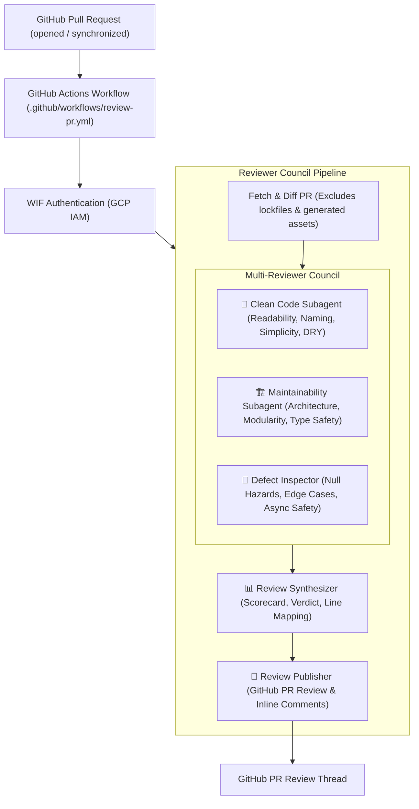

# SDLC Pull Request Reviewer Agent Service

The **Reviewer Agent** is an automated multi-agent code review service built on Google ADK and Antigravity. Whenever a Pull Request is opened or updated on GitHub, it automatically evaluates the code changes using a multi-reviewer council (Clean Code, Maintainability, and Defect Inspection) and posts a detailed scorecard summary with line-specific review suggestions directly to the Pull Request.

---

## Architecture Overview



---

## 1. Deploy to Google Cloud Run

### Prerequisites
- Google Cloud SDK (`gcloud`) installed and logged in
- Active GCP Project with billing enabled

### Deploy with Script
Run the automated deployment script from the repository root:

```bash
PROJECT_ID="<your-gcp-project-id>" \
REGION="us-central1" \
./scripts/deploy_reviewer_cloud_run.sh
```

#### What the script configures:
- Uses existing IAM and Vertex AI permissions on your Service Account.
- Builds the multi-runtime container (Python 3.12, Node.js 20, Git, GitHub CLI) and deploys to Cloud Run (2 vCPU, 4GB RAM, 3600s request timeout, authenticated access).
- Sets `GOOGLE_GENAI_USE_VERTEXAI=true` and `GOOGLE_GENAI_MODEL=gemini-3.7-flash`.

Note the output **Service URL** (e.g., `https://sdlc-reviewer-agent-...a.run.app`).

---

## 2. Configure GitHub Repository

Because Workload Identity Federation (WIF) and the Service Account are already established for the Implementer agent, you only need to configure the service URL variable.

### GitHub Repository Variable
In GitHub under **Settings > Secrets and variables > Actions > Variables**, add:

| Variable Name | Description | Example Value |
|---|---|---|
| `REVIEWER_SERVICE_URL` | Deployed Cloud Run Service URL for Reviewer | `https://sdlc-reviewer-agent-xyz-uc.a.run.app` |

*Note: Existing variables (`WIF_PROVIDER`, `WIF_SERVICE_ACCOUNT`, `GCP_PROJECT_ID`, `GCP_REGION`) are reused automatically.*

---

## 3. Workflow Invocation

### A. Automatic Trigger on Pull Request
Whenever a Pull Request is opened, synchronized with new commits, or reopened, the workflow [`.github/workflows/review-pr.yml`](../../.github/workflows/review-pr.yml) automatically triggers:

1. Authenticates to GCP via WIF using `REVIEWER_SERVICE_URL` as audience.
2. Invokes the Reviewer Agent on Cloud Run with SSE streaming.
3. The Reviewer Council analyzes the PR diff (excluding `package-lock.json`, `uv.lock`, build outputs).
4. Submits a formal PR Review with scorecard breakdown and inline suggestions.

### B. Manual Dispatch from GitHub Actions
Navigate to **Actions > Review Pull Request > Run workflow**, and enter:
- **PR Number**: `1` (or any target PR number)

### C. Local Development & CLI Invocation
To run or test the reviewer locally against a PR:

```bash
# Start local server or auto-launch via client CLI:
sdlc-agents/.venv/bin/python sdlc-agents/reviewer/client.py --pr 1 \
  --repo-url "https://github.com/owner/repo.git" \
  --github-token "$GITHUB_TOKEN"
```

Or target the remote Cloud Run service directly:

```bash
sdlc-agents/.venv/bin/python sdlc-agents/reviewer/client.py --pr 1 \
  --url "https://sdlc-reviewer-agent-xyz-uc.a.run.app" \
  --id-token "$(gcloud auth print-identity-token --audiences=https://sdlc-reviewer-agent-xyz-uc.a.run.app)" \
  --repo-url "https://github.com/owner/repo.git" \
  --github-token "$GITHUB_TOKEN"
```

---

## 4. Review Council Criteria

- **🧹 Clean Code & Readability**: Naming conventions, cognitive complexity, code smells, dead code removal, DRY adherence.
- **🏗️ Maintainability & Architecture**: Modularity, separation of concerns, strict type safety, extensibility, testability.
- **🐞 Defect & Edge-Case Safety**: Null/undefined safety, error boundaries, race conditions, parameter validation.
